I've removed all comments and optimized the markdown for your GitHub README.

```markdown
<h1 align="center">⚡ Welcome to My Digital Workshop</h1>
<h3 align="center">Victor Gp · Systems Architect & Full-Stack Engineer</h3>
<p align="center">Crafting resilient digital ecosystems where cutting-edge web technology meets scalable infrastructure</p>

<p align="center">
  <a href="https://victorgp.vercel.app">
    
  </a>
  <a href="https://linkedin.com/in/vheek10">
    
  </a>
  <a href="https://x.com/Vheek10">
    
  </a>
  <a href="mailto:jeremiahvictorgp@gmail.com">
    
  </a>
</p>

---

## 🧠 Engineering Philosophy

> *"I architect systems that don't just solve problems—they anticipate them. My code is infrastructure, my infrastructure is resilient, and my resilience is by design."*

I specialize in **distributed systems thinking**, where every component—from blockchain nodes to microservices—operates as part of a cohesive digital organism. My approach combines **mathematical rigor** (ZK cryptography, algorithmic efficiency) with **practical architecture** (cloud-native patterns, developer experience).

---

## 🔭 Current Technical Leadership

### **Systems Architect** · ValueContentAfrica · `2023 → Present`
- **Scalable Platform Design**: Orchestrated migration from monolithic to event-driven microservices, reducing API latency from 2.1s to 320ms for 10K+ concurrent users
- **Data Pipeline Engineering**: Built real-time analytics ingestion using Apache Kafka + PostgreSQL materialized views, processing 15GB/day of creator content metrics
- **DevEx Innovation**: Created internal CLI tools that reduced deployment complexity by 70% and onboarding time from 2 weeks to 3 days

### **Protocol Architect** · StrataDeed · `2024 → Present`
- **Cryptographic Systems**: Designed confidential transaction layers using PLONK-based ZK circuits, enabling private real estate fractionalization
- **Cross-Chain Architecture**: Implemented modular validator nodes that reduce cross-chain settlement time from 15 minutes to 45 seconds
- **Infrastructure-as-Code**: Developed Terraform modules for automated deployment across AWS, GCP, and bare-metal blockchain nodes

### **Technical Consultant** · Various Clients · `2022 → Present`
- **High-Frequency Systems**: Optimized trading engine matching algorithms achieving 99.99% uptime with sub-10ms transaction finality
- **Edge Computing**: Deployed WebAssembly runtimes on CDN edges, reducing global API response variance from 800ms to 120ms
- **Protocol Research**: Authored technical papers on verifiable delay functions (VDFs) and their application to decentralized sequencing

---

## 🛠️ Technical Universe

### Computational Paradigms
```
┌─────────────────────────────────────────────────────────────┐
│  Frontend Engineering       │  Backend Systems              │
│  • React/Next.js Hooks     │  • Node.js Event Loop Mastery │
│  • WebAssembly Integration │  • Rust for Performance       │
│  • PWA & Offline-First     │  • GraphQL Federation         │
│  • WebGL Data Viz          │  • gRPC Microservices         │
├─────────────────────────────────────────────────────────────┤
│  Infrastructure            │  Cryptographic Foundations     │
│  • Kubernetes Orchestration│  • Zero-Knowledge Proofs      │
│  • Service Mesh (Istio)   │  • MPC & Threshold Signatures │
│  • GitOps (ArgoCD)        │  • Homomorphic Encryption     │
│  • Observability Stack     │  • Post-Quantum Readiness     │
└─────────────────────────────────────────────────────────────┘
```

### Toolchain Resonance
<p align="center">
  
</p>

---

## 🌌 Project Constellation

<table>
  <tr>
    <td>
      <h4>🪐 <a href="https://strata-deed.vercel.app">StrataDeed</a></h4>
      <p><code>Next.js · ZK-SNARKs · Mantle L2 · IPFS</code></p>
      <p>Real estate fractionalization protocol with privacy-preserving ownership verification using recursive ZK proofs.</p>
    </td>
    <td>
      <h4>🌍 <a href="https://github.com/vheek10/valuecontentafrica">ValueContentAfrica</a></h4>
      <p><code>Microservices · Event Sourcing · Kafka · Next.js</code></p>
      <p>Creator economy platform with predictive analytics engine and automated revenue distribution.</p>
    </td>
  </tr>
  <tr>
    <td>
      <h4>🔭 <a href="https://polysight.vercel.app">PolySight</a></h4>
      <p><code>React · The Graph · WebGL · Material-UI</code></p>
      <p>3D blockchain explorer visualizing transaction flows and smart contract interactions in real-time.</p>
    </td>
    <td>
      <h4>🎬 <a href="https://disney-plus-master.vercel.app">StreamCore</a></h4>
      <p><code>React · WebRTC · FFmpeg.wasm · IndexedDB</code></p>
      <p>Adaptive streaming platform with offline playback and edge-computed video transcoding.</p>
    </td>
  </tr>
</table>

---

## 📡 Systems Telemetry

```mermaid
graph LR
    A[Code Commits] --> B[CI/CD Pipeline];
    B --> C[Container Registry];
    C --> D[K8s Cluster];
    D --> E[Observability];
    E --> F[Developer Feedback];
    F --> A;
    
    style A fill:#0D1117,stroke:#58A6FF
    style B fill:#0D1117,stroke:#58A6FF
    style C fill:#0D1117,stroke:#58A6FF
    style D fill:#0D1117,stroke:#58A6FF
    style E fill:#0D1117,stroke:#58A6FF
    style F fill:#0D1117,stroke:#58A6FF
```



<div align="center">

| **Architectural Output** | **System Performance** |
| :---: | :---: |
|  |  |

| **Language Spectrum** | **Contribution Vector** |
| :---: | :---: |
|  |  |

</div>

---

## 🧩 Currently Exploring

```python
class TechnicalFrontiers:
    def __init__(self):
        self.quantum_resistant_cryptography = True
        self.edge_ai_inference = True
        self.formal_verification = True
        self.biomimetic_algorithms = True
    
    def research_vector(self):
        return [
            "ZKML: Zero-Knowledge Machine Learning",
            "CRDT-based collaborative editing at scale",
            "WASM runtime security formalization",
            "Differential privacy in federated learning"
        ]
```

---

<p align="center">
  <strong>💡 Let's architect the impossible.</strong><br>
  <em>I'm currently consulting on projects involving distributed systems, cryptographic protocols, and infrastructure at planetary scale.</em>
</p>
```
